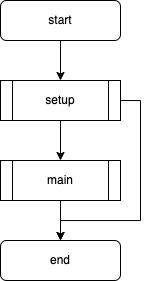
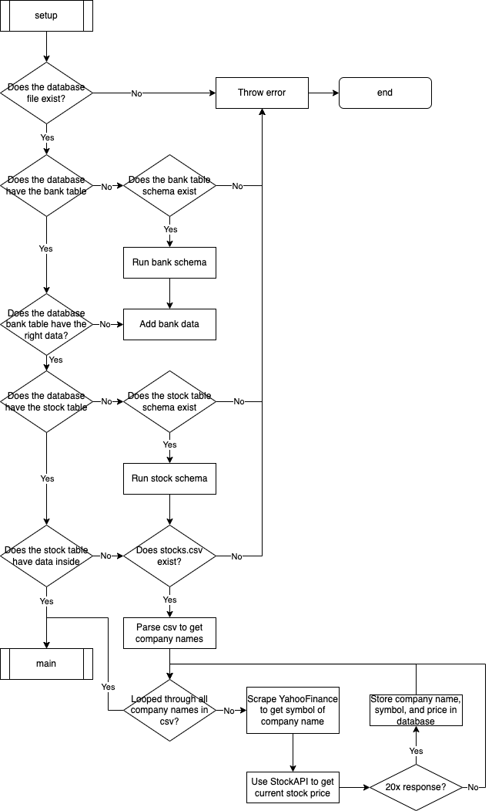

# Dev Log

## 10-10-2024 12:37

I have decided as my final project for CS50x that I want to create a paper trading bot. To do this I have the idea to adapt the _unbounded knapsack problem's_ algorithm with inspirations of weights in AI development to come up with an adaptable software that can make choices on whether to buy or sell stocks with a budget. I want to use paper money to see if the concept works.

To do this, I have decided to use modularisation to organise the code and have the following classes:

| Class Name            | Description                                                                                                         |
|-----------------------|---------------------------------------------------------------------------------------------------------------------|
| `DatabaseConnection`  | Interact with the SQLite database to persist data of the stocks and bank.                                           |
| `DatabaseInitialiser` | A sublass of `DatabaseConnection` that includes methods to initialise the database. Used as a utility class.        |
| `StockAPI`            | An adapter class that will abstract the stock api, in this case finance.cs50.io                                     |
| `Trading Algorithm`   | A stratergy class that will use the bounded knapsack algorithm to calculate the best portfolio at the current time. |

These classes will all be used in the `app.py` file to update everything once, and use a cron job to run the program periodically.

## 10-10-2024 13:27

I have created a flowchart for the overall program as well as the setup function:

