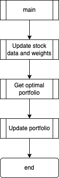
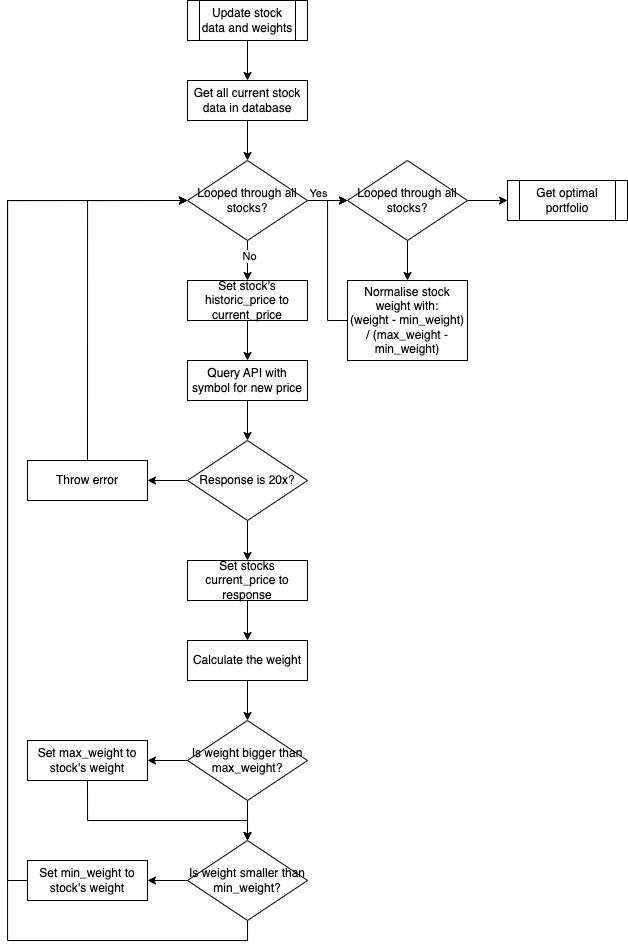
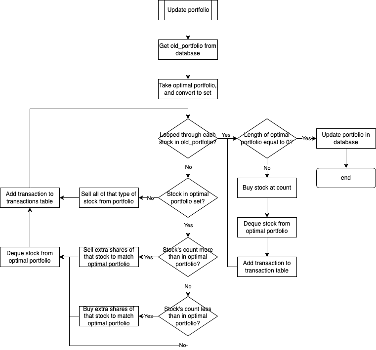
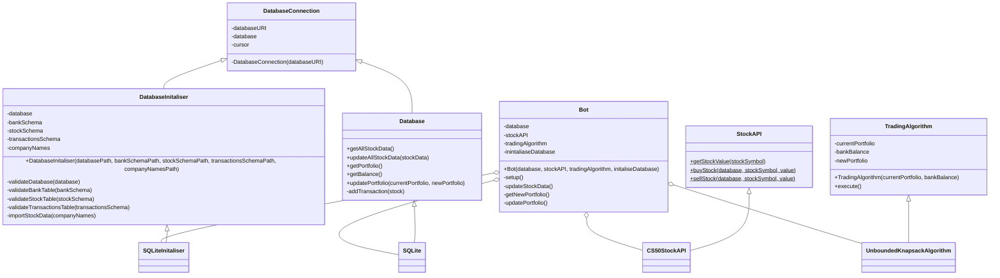

# Dev Log

## 10-10-2024 12:37

I have decided as my final project for CS50x that I want to create a paper trading bot. To do this I have the idea to adapt the _unbounded knapsack problem's_ algorithm with inspirations of weights in AI development to come up with an adaptable software that can make choices on whether to buy or sell stocks with a budget. I want to use paper money to see if the concept works.

To do this, I have decided to use modularisation to organise the code and have the following classes:

| Class Name            | Description                                                                                                         |
|-----------------------|---------------------------------------------------------------------------------------------------------------------|
| `DatabaseConnection`  | Interact with the SQLite database to persist data of the stocks and bank.                                           |
| `DatabaseInitialiser` | A sublass of `DatabaseConnection` that includes methods to initialise the database. Used as a utility class.        |
| `StockAPI`            | An adapter class that will abstract the stock api, in this case finance.cs50.io                                     |
| `TradingAlgorithm`    | A stratergy class that will use the bounded knapsack algorithm to calculate the best portfolio at the current time. |
| `Bot`                 | The manager of the project, filled with static methods for the main loop                                            |

These classes will all be used in the `app.py` file to update everything once, and use a cron job to run the program periodically.

## 10-10-2024 13:27

I have created a flowchart for the overall program as well as the setup function:

### Overview


### Setup


## 10-10-2024 14:24

Created the flowchart for the main section, decided to further abstract it. I'm also adding a class `Bot` to manage all these things and run main

### Main



### Update Stock Data and Weights



## 10-10-2024 15:36

After a lot of research and tinkering, I have been able to take an unbounded knapsack algorithm and make it so it will return to me the items that were picked for the heighest value given the budget for weight. The values are a bit the wrong way round as the `PRICE` would be the `weight` column, and the `WEIGHT` would be the `price` column.

### Code
```py
def uks_rec(BUDGET, STOCKS, INDEX):
    if INDEX == 0:
        count = BUDGET // STOCKS[0]["weight"]
        return (count * STOCKS[0]["price"], [STOCKS[0]["id"]] * count)

    not_take_val, not_take_items = uks_rec(BUDGET, STOCKS, INDEX - 1)

    take_val = float("-inf")
    take_items = []
    if STOCKS[INDEX]["weight"] <= BUDGET:
        take_val_recursive, take_items_recursive = uks_rec(
            BUDGET - STOCKS[INDEX]["weight"], STOCKS, INDEX
        )
        take_val = STOCKS[INDEX]["price"] + take_val_recursive
        take_items = [STOCKS[INDEX]["id"]] + take_items_recursive

    if take_val > not_take_val:
        return (take_val, take_items)
    else:
        return (not_take_val, not_take_items)


def uks(BUDGET, STOCKS):
    N = len(STOCKS)
    return uks_rec(BUDGET, STOCKS, N - 1)


if __name__ == "__main__":
    BUDGET = 100
    STOCKS = [
        {
            "id": 1,
            "price": 10,
            "weight": 5,
        },
        {
            "id": 2,
            "price": 30,
            "weight": 10,
        },
        {
            "id": 3,
            "price": 20,
            "weight": 15,
        },
    ]
    _, selected_items = uks(BUDGET, STOCKS)

    print("Stocks selected: ", selected_items)
```

### Output
```
Stocks selected:  [2, 2, 2, 2, 2, 2, 2, 2, 2, 2]
```

## 10-10-2024 16:05

I have finally added the update_portfolio section to the flow chart. Now I need to design and plan the Classes. I think I want to use UML diagrams for this so I can refer back to it while programming:

### Update Portfolio



## 11-10-2024 11:21

I have created the UML class diagram with all the methods and attributes as well as the relationships. I wish there was a way to import data from the database and make it all in objects, but I think this will be a waste of compute time in the long run and with python not having type checking, I don't see the point.


