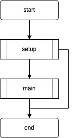
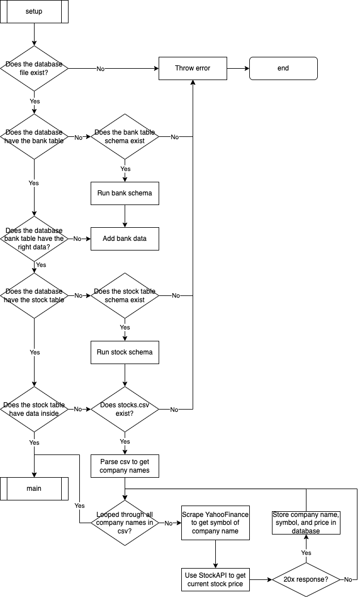
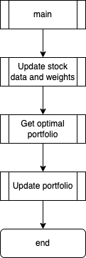
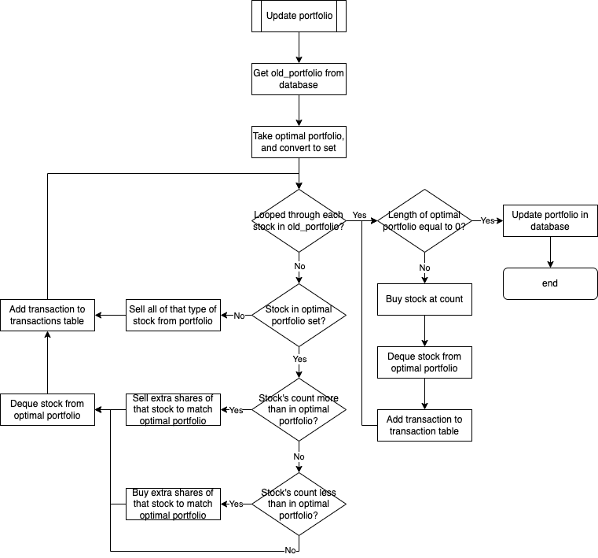
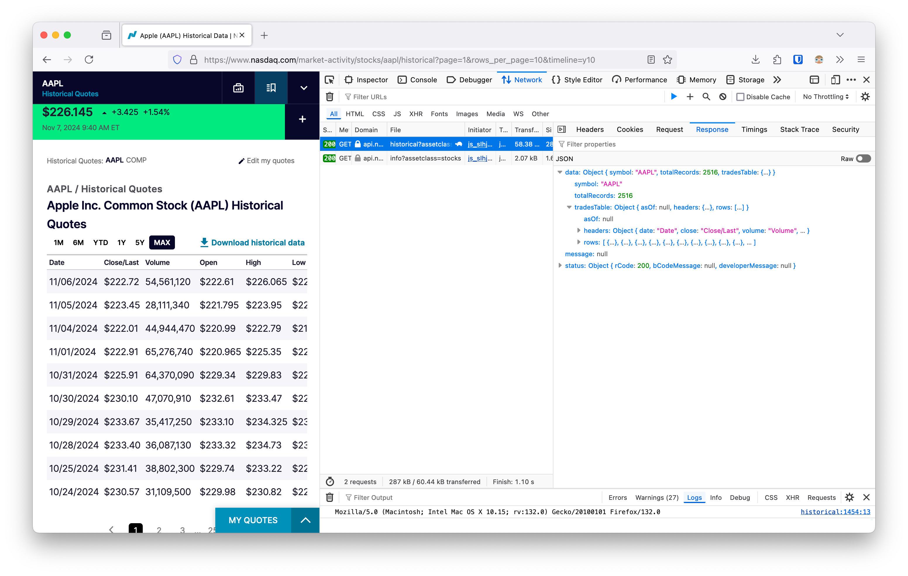
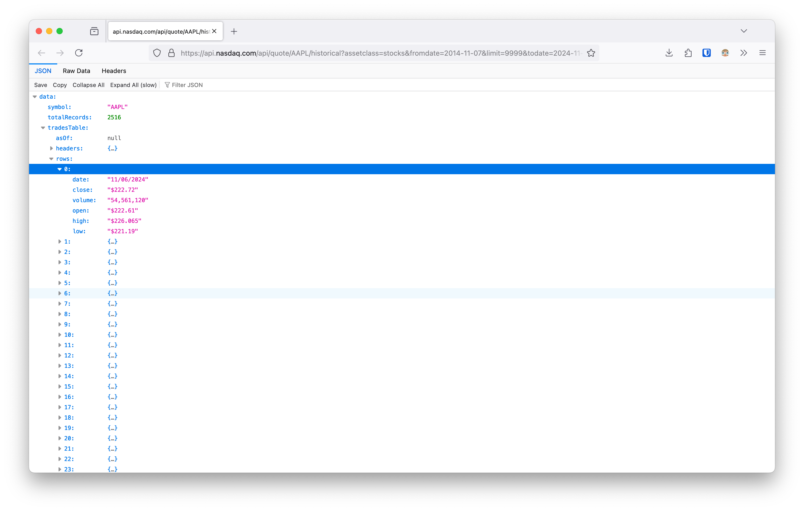

# Dev Log

## 10-10-2024 12:37

I have decided as my final project for CS50x that I want to create a paper trading bot. To do this I have the idea to adapt the _unbounded knapsack problem's_ algorithm with inspirations of weights in AI development to come up with an adaptable software that can make choices on whether to buy or sell stocks with a budget. I want to use paper money to see if the concept works.

To do this, I have decided to use modularisation to organise the code and have the following classes:

| Class Name            | Description                                                                                                         |
|-----------------------|---------------------------------------------------------------------------------------------------------------------|
| `DatabaseConnection`  | Interact with the SQLite database to persist data of the stocks and bank.                                           |
| `DatabaseInitialiser` | A sublass of `DatabaseConnection` that includes methods to initialise the database. Used as a utility class.        |
| `StockAPI`            | An adapter class that will abstract the stock api, in this case finance.cs50.io                                     |
| `TradingAlgorithm`    | A stratergy class that will use the bounded knapsack algorithm to calculate the best portfolio at the current time. |
| `Bot`                 | The manager of the project, filled with static methods for the main loop                                            |

These classes will all be used in the `app.py` file to update everything once, and use a cron job to run the program periodically.

## 10-10-2024 13:27

I have created a flowchart for the overall program as well as the setup function:

### Overview



### Setup



## 10-10-2024 14:24

Created the flowchart for the main section, decided to further abstract it. I'm also adding a class `Bot` to manage all these things and run main

### Main



### Update Stock Data and Weights


## 10-10-2024 15:36

After a lot of research and tinkering, I have been able to take an unbounded knapsack algorithm and make it so it will return to me the items that were picked for the heighest value given the budget for weight. The values are a bit the wrong way round as the `PRICE` would be the `weight` column, and the `WEIGHT` would be the `price` column.

### Code
```py
def uks_rec(BUDGET, STOCKS, INDEX):
    if INDEX == 0:
        count = BUDGET // STOCKS[0]["weight"]
        return (count * STOCKS[0]["price"], [STOCKS[0]["id"]] * count)

    not_take_val, not_take_items = uks_rec(BUDGET, STOCKS, INDEX - 1)

    take_val = float("-inf")
    take_items = []
    if STOCKS[INDEX]["weight"] <= BUDGET:
        take_val_recursive, take_items_recursive = uks_rec(
            BUDGET - STOCKS[INDEX]["weight"], STOCKS, INDEX
        )
        take_val = STOCKS[INDEX]["price"] + take_val_recursive
        take_items = [STOCKS[INDEX]["id"]] + take_items_recursive

    if take_val > not_take_val:
        return (take_val, take_items)
    else:
        return (not_take_val, not_take_items)


def uks(BUDGET, STOCKS):
    N = len(STOCKS)
    return uks_rec(BUDGET, STOCKS, N - 1)


if __name__ == "__main__":
    BUDGET = 100
    STOCKS = [
        {
            "id": 1,
            "price": 10,
            "weight": 5,
        },
        {
            "id": 2,
            "price": 30,
            "weight": 10,
        },
        {
            "id": 3,
            "price": 20,
            "weight": 15,
        },
    ]
    _, selected_items = uks(BUDGET, STOCKS)

    print("Stocks selected: ", selected_items)
```

### Output
```
Stocks selected:  [2, 2, 2, 2, 2, 2, 2, 2, 2, 2]
```

## 10-10-2024 16:05

I have finally added the update_portfolio section to the flow chart. Now I need to design and plan the Classes. I think I want to use UML diagrams for this so I can refer back to it while programming:

### Update Portfolio



## 11-10-2024 11:21

I have created the UML class diagram with all the methods and attributes as well as the relationships. I wish there was a way to import data from the database and make it all in objects, but I think this will be a waste of compute time in the long run and with python not having type checking, I don't see the point.


## 11-10-2024 13:09

After doing some research using: [getting started with pytest (beginner - intermediate) anthony explains #518](https://www.youtube.com/watch?v=mzlH8lp4ISA) I have decided to use _pytest_ as my testing framework and the following file structure:
```sh
.
├── Dockerfile
├── LICENSE
├── src
│   ├── __init__.py
│   ├── bot.py
│   ├── database.py
│   ├── stock_api.py
│   └── trading_algorithm.py
└── tests
    ├── test_bot.py
    ├── test_database.py
    ├── test_stock_api.py
    └── test_trading_algorithm.py

3 directories, 11 files
```

This will give me a seperation of concerns for each class type. The next step is to setup the venv, which should be pretty easy.

For the venv, you use `python3 -m venv [dir for venv]`. This is pretty simple and then you can use `./bin/activate` to enter into the venv. The only thing I will be adding is the _pytest_ framework by using `pip3 install pytest` while inside the venv.

Once this is done, I will add the classes to implement.

## 11-10-2024 16:09

Been trying to setup testing and classes for the database, but couldn't figure out how to import the classes from `/src` into `/tests`. To solve this I created a `pyproject.toml` file and added the following:
```toml
[tool.pytest.ini_options]
pythonpath = [
    "src"
]
```

Thanks to __hoefling__ on [stack overflow](https://www.stackoverflow.com) for the [answer](https://www.stackoverflow.com/questions/50155464/using-pytest-with-a-src-layer#answer-50156706)

## 07-11-2024 12:33

Wow I haven't looked at this for a while... I have decided to do a quick proof of concept to make sure this idea works on a new branch `feature/proof-of-concept`. This will save me time from doing _ttd_ and actually get a working prototype.

As well as this, I joined a _Python_ discord server and asked them the best way to go about testing with a database. Thanks to their community I think the best way to go about it is to make a test database, but let's not get ahead of ourselves and actully make sure the idea works


## 07-11-2024 14:41

I finally created a scraper to get all the historic data for all the stocks I want to do. Here are the things I learnt:

- You can export SQL queries in the `sqlite3` program by doing the following (Thanks __gdw2__ on [stack overflow](https://stackoverflow.com/questions/6076984/sqlite-how-do-i-save-the-result-of-a-query-as-a-csv-file#answer-6077039)):
```sql
.mode csv
.output test.csv
SELECT * FROM table;
.output stdout
```

- There is a NASDAQ API for getting historic data that I used the FireFox dev tools network tab to be able to get the URL

---


- You can use `datetime` and `timedelta` to create a range for the dates, so that everything lines up when you export the dict to a csv

- There is a logging library to make logging look nicer (I used this to log the scraping stage)

- Dictionary comprehension. It's like list comprehension, but for dicts (This one sounds silly but I didn't know about it until now and seems like a useful feature, but may not be KISS friendly...)

Here is the output when I did the scrape:
```sh
07-11-2024 14:52:06 - [INFO] Request for WMT complete.
07-11-2024 14:52:08 - [INFO] Request for AMZN complete.
07-11-2024 14:52:09 - [INFO] Request for AAPL complete.
07-11-2024 14:52:10 - [INFO] Request for UNH complete.
07-11-2024 14:52:11 - [INFO] Request for CVS complete.
07-11-2024 14:52:12 - [INFO] Request for XOM complete.
07-11-2024 14:52:13 - [INFO] Request for SHEL complete.
07-11-2024 14:52:15 - [INFO] Request for TM complete.
07-11-2024 14:52:18 - [INFO] Request for MCK complete.
07-11-2024 14:52:19 - [INFO] Request for GOOG complete.
07-11-2024 14:52:20 - [INFO] Request for COR complete.
07-11-2024 14:52:21 - [INFO] Request for COST complete.
07-11-2024 14:52:22 - [INFO] Request for JPM complete.
07-11-2024 14:52:24 - [INFO] Request for TTE complete.
07-11-2024 14:52:25 - [INFO] Request for BP complete.
07-11-2024 14:52:26 - [INFO] Request for MSFT complete.
07-11-2024 14:52:27 - [INFO] Request for CAH complete.
07-11-2024 14:52:29 - [INFO] Request for STLA complete.
07-11-2024 14:52:31 - [INFO] Request for CVX complete.
07-11-2024 14:52:32 - [INFO] Request for CI complete.
07-11-2024 14:52:33 - [INFO] Request for F complete.
07-11-2024 14:52:34 - [INFO] Request for BAC complete.
07-11-2024 14:52:36 - [INFO] Request for GM complete.
07-11-2024 14:52:37 - [INFO] Request for ELV complete.
07-11-2024 14:52:38 - [INFO] Request for C complete.
07-11-2024 14:52:39 - [INFO] Request for CNC complete.
07-11-2024 14:52:41 - [INFO] Request for JD complete.
07-11-2024 14:52:42 - [INFO] Request for HD complete.
07-11-2024 14:52:44 - [INFO] Request for MPC complete.
07-11-2024 14:52:45 - [INFO] Request for KR complete.
07-11-2024 14:52:46 - [INFO] Request for PSX complete.
07-11-2024 14:52:48 - [INFO] Request for HMC complete.
07-11-2024 14:52:49 - [INFO] Request for WBA complete.
07-11-2024 14:52:50 - [INFO] Request for VLO complete.
07-11-2024 14:52:51 - [INFO] Request for SAN complete.
07-11-2024 14:52:54 - [INFO] Request for MUFG complete.
07-11-2024 14:52:55 - [INFO] Request for META complete.
07-11-2024 14:52:56 - [INFO] Request for HSBC complete.
07-11-2024 14:52:57 - [INFO] Request for VZ complete.
07-11-2024 14:52:58 - [INFO] Request for BABA complete.
07-11-2024 14:53:00 - [INFO] Request for T complete.
07-11-2024 14:53:01 - [INFO] Request for CMCSA complete.
07-11-2024 14:53:02 - [INFO] Request for WFC complete.
07-11-2024 14:53:05 - [INFO] Request for NCV complete.
07-11-2024 14:53:06 - [INFO] Request for GS complete.
07-11-2024 14:53:07 - [INFO] Request for TGT complete.
07-11-2024 14:53:08 - [INFO] Request for EQNR complete.
07-11-2024 14:53:09 - [INFO] Request for HUM complete.
07-11-2024 14:53:11 - [INFO] Request for ENIC complete.
07-11-2024 14:53:12 - [INFO] Request for E complete.
07-11-2024 14:53:13 - [INFO] Request for PBR complete.
07-11-2024 14:53:14 - [INFO] Request for SWKS complete.
07-11-2024 14:53:17 - [INFO] Request for TSLA complete.
07-11-2024 14:53:18 - [INFO] Request for MS complete.
07-11-2024 14:53:19 - [INFO] Request for BEP complete.
07-11-2024 14:53:20 - [INFO] Request for JNJ complete.
07-11-2024 14:53:22 - [INFO] Request for ADM complete.
07-11-2024 14:53:23 - [INFO] Request for SMFG complete.
07-11-2024 14:53:24 - [INFO] Request for PEP complete.
07-11-2024 14:53:25 - [INFO] Request for UPS complete.
07-11-2024 14:53:26 - [INFO] Request for AXTA complete.
07-11-2024 14:53:29 - [INFO] Request for FDX complete.
07-11-2024 14:53:30 - [INFO] Request for SONY complete.
07-11-2024 14:53:31 - [INFO] Request for DIS complete.
07-11-2024 14:53:32 - [INFO] Request for DELL complete.
07-11-2024 14:53:33 - [INFO] Request for RY complete.
07-11-2024 14:53:35 - [INFO] Request for LOW complete.
07-11-2024 14:53:36 - [INFO] Request for BYD complete.
07-11-2024 14:53:37 - [INFO] Request for MUFG complete.
07-11-2024 14:53:38 - [INFO] Request for PG complete.
07-11-2024 14:53:41 - [INFO] Request for ACI complete.
07-11-2024 14:53:42 - [INFO] Request for ET complete.
07-11-2024 14:53:43 - [INFO] Request for BA complete.
07-11-2024 14:53:44 - [INFO] Request for SYY complete.
07-11-2024 14:53:45 - [INFO] Request for VINP complete.
07-11-2024 14:53:47 - [INFO] Request for TD complete.
07-11-2024 14:53:48 - [INFO] Request for JBSS complete.
07-11-2024 14:53:49 - [INFO] Request for UBS complete.
07-11-2024 14:53:50 - [INFO] Request for TSM complete.
07-11-2024 14:53:52 - [INFO] Request for RTX complete.
07-11-2024 14:53:53 - [INFO] Request for ITUB complete.
07-11-2024 14:53:54 - [INFO] Request for MT complete.
07-11-2024 14:53:55 - [INFO] Request for GE complete.
07-11-2024 14:53:57 - [INFO] Request for LMT complete.
07-11-2024 14:53:58 - [INFO] Request for AXP complete.
07-11-2024 14:53:59 - [INFO] Request for CAT complete.
07-11-2024 14:54:00 - [INFO] Request for BBVA complete.
07-11-2024 14:54:01 - [INFO] Request for KEP complete.
07-11-2024 14:54:04 - [INFO] Request for MET complete.
07-11-2024 14:54:05 - [INFO] Request for AEON complete.
07-11-2024 14:54:06 - [INFO] Request for LYG complete.
07-11-2024 14:54:07 - [INFO] Request for DB complete.
07-11-2024 14:54:08 - [INFO] Request for HCA complete.
07-11-2024 14:54:10 - [INFO] Request for SMFG complete.
07-11-2024 14:54:11 - [INFO] Request for UL complete.
07-11-2024 14:54:12 - [INFO] Request for ACN complete.
07-11-2024 14:54:13 - [INFO] Request for BCS complete.
07-11-2024 14:54:16 - [INFO] Request for PGR complete.
07-11-2024 14:54:17 - [INFO] Request for IBM complete.
07-11-2024 14:54:18 - [INFO] Request for DE complete.
07-11-2024 14:54:19 - [INFO] Request for NVDA complete.
07-11-2024 14:54:20 - [INFO] Request for SNEX complete.
07-11-2024 14:54:22 - [INFO] Request for MFG complete.
07-11-2024 14:54:23 - [INFO] Request for ING complete.
07-11-2024 14:54:24 - [INFO] Request for MRK complete.
07-11-2024 14:54:25 - [INFO] Request for BG complete.
07-11-2024 14:54:27 - [INFO] Request for BUD complete.
07-11-2024 14:54:28 - [INFO] Request for PKX complete.
07-11-2024 14:54:29 - [INFO] Request for COP complete.
07-11-2024 14:54:31 - [INFO] Request for PFE complete.
07-11-2024 14:54:32 - [INFO] Request for DAL complete.
07-11-2024 14:54:33 - [INFO] Request for SNX complete.
07-11-2024 14:54:34 - [INFO] Request for ALL complete.
07-11-2024 14:54:35 - [INFO] Request for CSCO complete.
07-11-2024 14:54:36 - [INFO] Request for BBD complete.
07-11-2024 14:54:39 - [INFO] Request for CHTR complete.
07-11-2024 14:54:40 - [INFO] Request for ABBV complete.
07-11-2024 14:54:41 - [INFO] Request for INTC complete.
07-11-2024 14:54:42 - [INFO] Request for TJX complete.
07-11-2024 14:54:44 - [INFO] Request for NVS complete.
07-11-2024 14:54:45 - [INFO] Request for RIO complete.
07-11-2024 14:54:46 - [INFO] Request for PRU complete.
07-11-2024 14:54:47 - [INFO] Request for BHP complete.
07-11-2024 14:54:48 - [INFO] Request for HP complete.
07-11-2024 14:54:51 - [INFO] Request for UAL complete.
07-11-2024 14:54:52 - [INFO] Request for PFGC complete.
07-11-2024 14:54:53 - [INFO] Request for TSN complete.
07-11-2024 14:54:54 - [INFO] Request for AAL complete.
07-11-2024 14:54:55 - [INFO] Request for BNS complete.
07-11-2024 14:54:56 - [INFO] Request for NKE complete.
07-11-2024 14:54:58 - [INFO] Request for BMO complete.
07-11-2024 14:54:59 - [INFO] Request for KB complete.
07-11-2024 14:55:00 - [INFO] Request for SNY complete.
07-11-2024 14:55:03 - [INFO] Request for ORCL complete.
07-11-2024 14:55:04 - [INFO] Request for CB complete.
07-11-2024 14:55:05 - [INFO] Request for EPD complete.
07-11-2024 14:55:06 - [INFO] Request for COF complete.
07-11-2024 14:55:07 - [INFO] Request for HDB complete.
07-11-2024 14:55:09 - [INFO] Request for VOD complete.
07-11-2024 14:55:10 - [INFO] Request for PAGP complete.
07-11-2024 14:55:11 - [INFO] Request for SMFG complete.
07-11-2024 14:55:12 - [INFO] Request for WKC complete.
07-11-2024 14:55:14 - [ERROR] Request for ORAN failed with status code 400.
07-11-2024 14:55:16 - [INFO] Request for AIG complete.
07-11-2024 14:55:17 - [INFO] Request for AMX complete.
07-11-2024 14:55:20 - [INFO] Request for AZN complete.
07-11-2024 14:55:22 - [INFO] Request for KO complete.
07-11-2024 14:55:24 - [INFO] Request for CHSCO complete.
07-11-2024 14:55:27 - [INFO] Request for BMY complete.
07-11-2024 14:55:29 - [INFO] Request for TY complete.
07-11-2024 14:55:31 - [INFO] Request for DOW complete.
07-11-2024 14:55:33 - [INFO] Request for FMX complete.
07-11-2024 14:55:34 - [INFO] Request for TEF complete.
07-11-2024 14:55:38 - [INFO] Request for BBY complete.
07-11-2024 14:55:40 - [INFO] Request for TMO complete.
07-11-2024 14:55:41 - [INFO] Request for MGA complete.
07-11-2024 14:55:43 - [INFO] Request for GD complete.
07-11-2024 14:55:45 - [INFO] Request for VALE complete.
07-11-2024 14:55:47 - [INFO] Request for TRV complete.
07-11-2024 14:55:50 - [INFO] Request for WBD complete.
07-11-2024 14:55:52 - [INFO] Request for CM complete.
07-11-2024 14:55:54 - [INFO] Request for LYB complete.
07-11-2024 14:55:56 - [INFO] Request for USB complete.
07-11-2024 14:55:57 - [INFO] Request for ABT complete.
07-11-2024 14:55:59 - [INFO] Request for NOC complete.
07-11-2024 14:56:03 - [INFO] Request for DG complete.
07-11-2024 14:56:05 - [INFO] Request for CVE complete.
07-11-2024 14:56:07 - [ERROR] Request for ACST failed with status code 400.
07-11-2024 14:56:08 - [INFO] Request for COOP complete.
07-11-2024 14:56:11 - [INFO] Request for PBF complete.
07-11-2024 14:56:14 - [INFO] Request for GSK complete.
07-11-2024 14:56:16 - [INFO] Request for SU complete.
07-11-2024 14:56:18 - [INFO] Request for UBER complete.
07-11-2024 14:56:20 - [INFO] Request for HON complete.
07-11-2024 14:56:21 - [INFO] Request for MDLZ complete.
07-11-2024 14:56:23 - [INFO] Request for SBUX complete.
07-11-2024 14:56:26 - [INFO] Request for QCOM complete.
07-11-2024 14:56:28 - [INFO] Request for AVGO complete.
07-11-2024 14:56:29 - [INFO] Request for USFD complete.
07-11-2024 14:56:31 - [INFO] Request for DHI complete.
07-11-2024 14:56:33 - [INFO] Request for PM complete.
07-11-2024 14:56:35 - [INFO] Request for PCAR complete.
07-11-2024 14:56:37 - [INFO] Request for PDD complete.
07-11-2024 14:56:39 - [INFO] Request for CRH complete.
07-11-2024 14:56:41 - [INFO] Request for CRM complete.
07-11-2024 14:56:43 - [INFO] Request for NUE complete.
07-11-2024 14:56:44 - [INFO] Request for JBL complete.
07-11-2024 14:56:46 - [INFO] Request for SAP complete.
07-11-2024 14:56:49 - [INFO] Request for LEN complete.
07-11-2024 14:56:51 - [INFO] Request for LLY complete.
07-11-2024 14:56:53 - [INFO] Request for MOH complete.
07-11-2024 14:56:54 - [INFO] Request for CMI complete.
07-11-2024 14:56:56 - [INFO] Request for BTI complete.
07-11-2024 14:56:58 - [INFO] Request for BK complete.
07-11-2024 14:57:01 - [INFO] Request for NFLX complete.
07-11-2024 14:57:05 - [INFO] Request for NVO complete.
07-11-2024 14:57:06 - [INFO] Request for TFC complete.
07-11-2024 14:57:08 - [INFO] Request for SLB complete.
07-11-2024 14:57:09 - [INFO] Request for EC complete.
07-11-2024 14:57:12 - [INFO] Request for ARW complete.
07-11-2024 14:57:14 - [INFO] Request for LIN complete.
07-11-2024 14:57:15 - [INFO] Request for MMM complete.
07-11-2024 14:57:17 - [INFO] Request for V complete.
07-11-2024 14:57:19 - [INFO] Request for APO complete.
07-11-2024 14:57:20 - [INFO] Request for ENB complete.
07-11-2024 14:57:22 - [INFO] Request for ABBV complete.
```

Which is a lot, and some didn't work (even though they do on the _finance.cs50.io_ API), but is a good starting point for me to get a POC

Finally, like they did in the CS50 SQL lecture, I imported all this data into a `.db` file so I can make queries on it later.

```sql
.mode csv stocks
.import historic_data stocks

SELECT * FROM stocks;
```

This showed that all the data was imported with the following schema:
```
CREATE TABLE IF NOT EXISTS "stocks"(
"ticker" TEXT, "datetime" TEXT, "price" TEXT);
```

## 07-11-2024 20:32

So I had to go and do some things, which means there was a big break between this update. During this time I did some research on whether I want to use an ORM, specifically SQLAlchemy, or just RAW SQL to interact with the database, and after careful consideration, I decided to just use RAW SQL for at least the POC. I decided this because, to be honest, I already know how to use it, which means I can develop quickly.

My plan is to use SQL, and not Python, to get the weights and then finally compute it in Python. I think this will be good practice for my RAW SQL.

In the meanwhile, I found out that SQLite doesn't support date objects, so instead of creating another script to update the date time objects in the db to epoch, I would add it to the scraper.

### References
[Raw SQL or ORM](https://www.youtube.com/watch?v=x1fCJ7sUXCM)
[datetime to EPOCH](https://www.geeksforgeeks.org/convert-python-datetime-to-epoch/)
